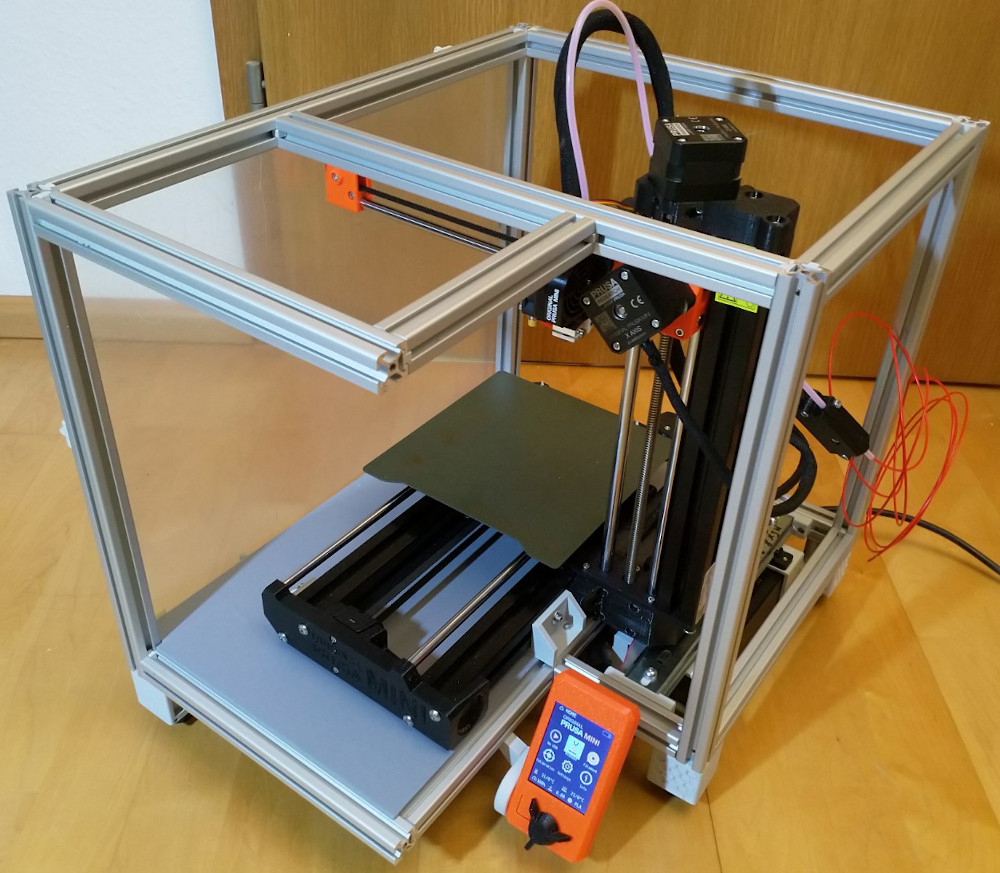
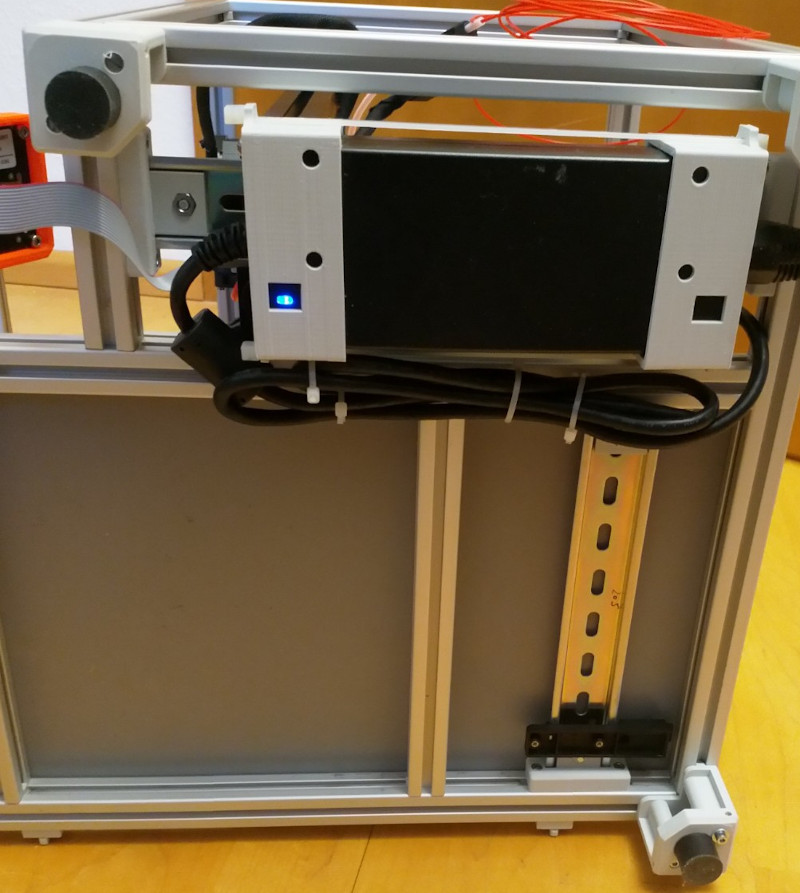
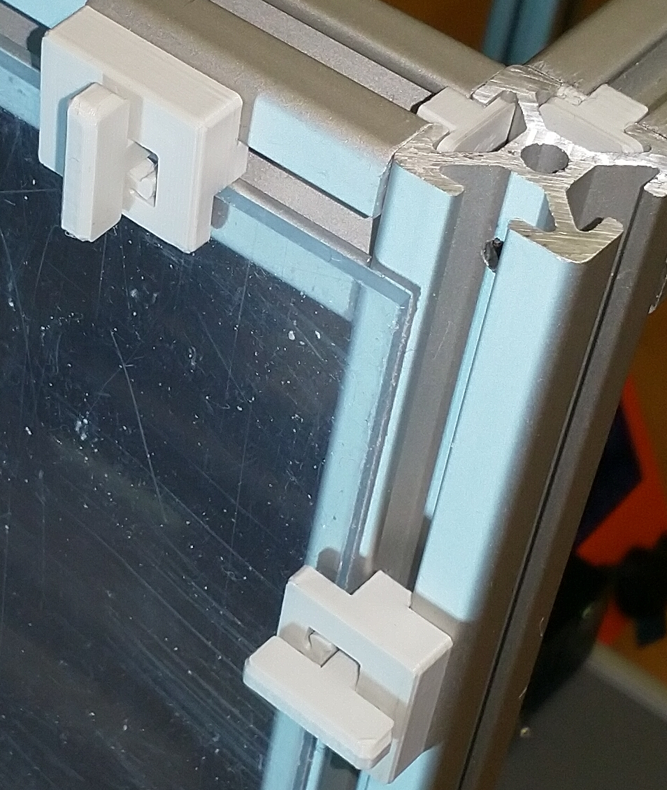

= K's MINI Enclosure: A Prusa MINI 3D Printer Enclosure
Stefan Katerkamp <info@katerkamp.de>

https://katerkamp.de/maker/k-mini-enclosure.xhtml[__K's-MINI-Enclosure__ by Stefan Katerkamp]
/ https://creativecommons.org/licenses/by/4.0[CC BY]

Homepage for this project is https://katerkamp.de/maker/k-mini-enclosure.xhtml[].

image::K-MINI-Enclosure.png[pdfwidth=90%,width=70%]

Current build:

DIN-Rail mount for power supply and optional controllers (Raspberry PI etc):

3D printed low cost blind joint centerplates and panel mount quickrelease parts:

