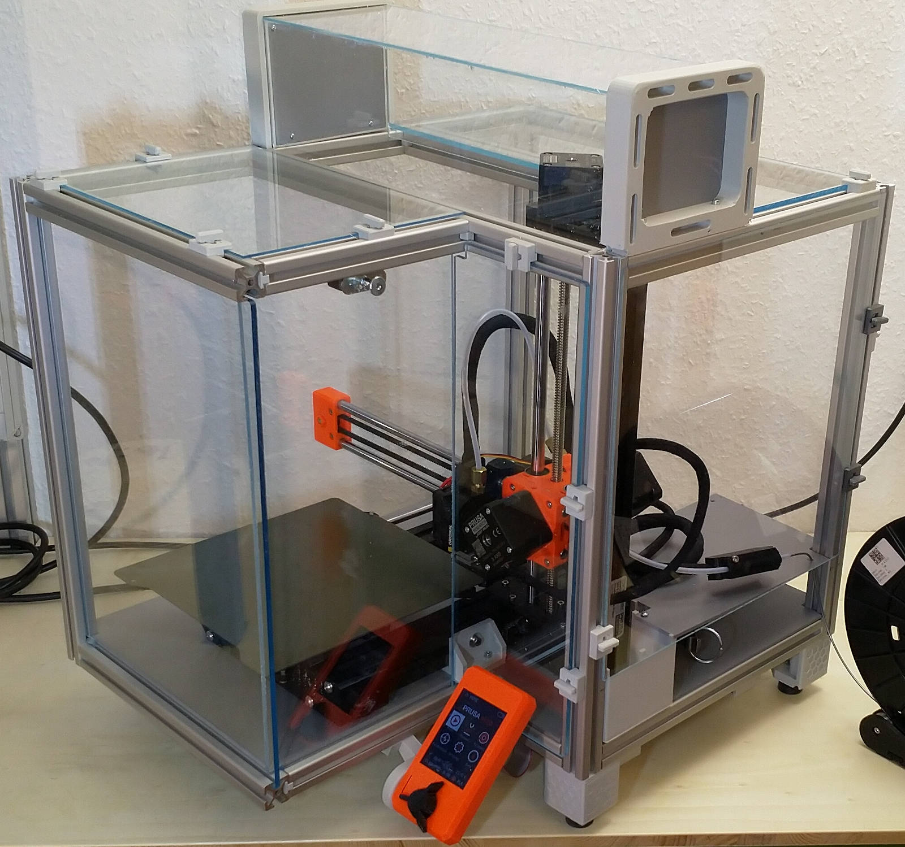

= K's MINI Enclosure: A Prusa MINI 3D Printer Enclosure
Stefan Katerkamp <info@katerkamp.de>

https://katerkamp.de/maker/k-mini-enclosure.xhtml[__K's-MINI-Enclosure__ by Stefan Katerkamp]
/ https://creativecommons.org/licenses/by/4.0[CC BY]

Goal of this project is to create a small, low cost enclosure for the
https://prusa3d.com/original-prusa-mini/[Original Prusa MINI],
based on ISP5-L20 (aka 2020-5mm-Slot) aluminum extrusions.
Such an enclosure helps to print higher temperature materials
such as ASA or ABS in a rather cold place, such as a garage.
Electronics and power supply stay outside of the warm air chamber.
Note: Precautions have to be taken that the chamber temperature does not get too hot.

Please check FreeCAD sources for detailed measurements before starting to cut anything.

This is an open source project including all https://freecadweb.org[FreeCAD] part construction files.
FreeCAD Version 0.18 or later with A2plus Assembly Workbench plugin required.

Project homepage is https://katerkamp.de/maker/k-mini-enclosure.xhtml[].

image::K-MINI-Enclosure.png[pdfwidth=90%,width=70%]

Current build:

DIN-Rail mount for power supply and optional controllers (Raspberry PI etc):

image::photos/Frame-Powerbrick+DINrails.jpg[pdfwidth=90%,width=70%]

