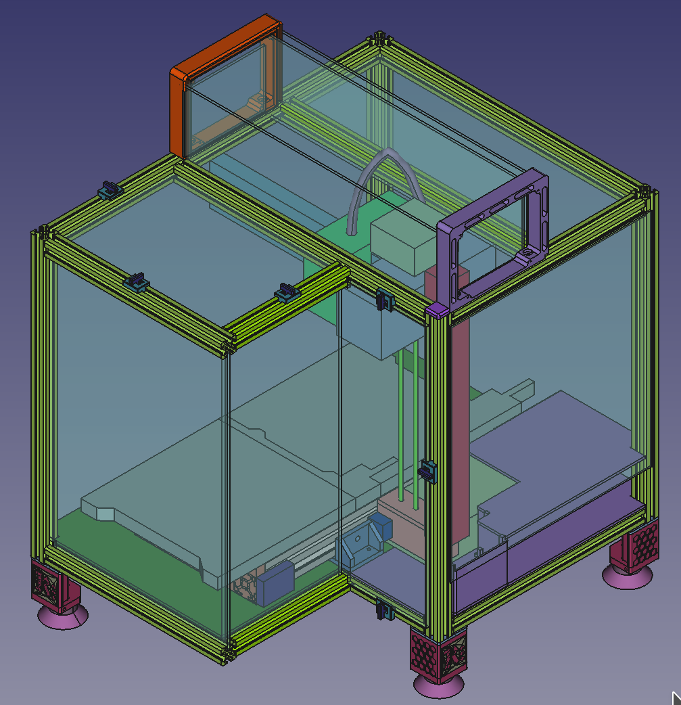

= K's MINI Enclosure: A Prusa MINI 3D Printer Enclosure
Stefan Katerkamp <info@katerkamp.de>

https://katerkamp.de/maker/k-mini-enclosure.xhtml[__K's-MINI-Enclosure__ by Stefan Katerkamp]
/ https://creativecommons.org/licenses/by/4.0[CC BY]

This is an open source project including all https://freecadweb.org[FreeCAD] part construction files.
FreeCAD Version 0.18 or later required.

Project goal is to create build instructions of a structured and low cost enclosure for the https://prusa3d.com/original-prusa-mini/[Original Prusa MINI],
consisting of as litte as possible flammable materials.

Checkout the homepage for more information: https://katerkamp.de/maker/k-mini-enclosure.xhtml[].

Current build:

image::photos/K-MINI-Enclosure.jpg[pdfwidth=90%,width=70%]

DIN-Rail mount for power supply and optional controllers (Raspberry PI etc):

3D printed low cost blind joint centerplates and panel mount quickrelease parts:

